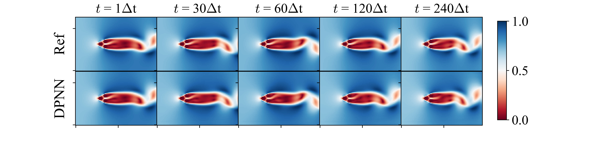

# DiffPhys-CylinderWakeFlow

This is the repository containing the source codes for **Unsteady Cylinder Wakes from Arbitrary Bodies with Differentiable Physics-Assisted Neural Network** by [`Shuvayan Brahmachary`](https://shuvayanb.github.io/about/) and [`Nils Thuerey`](https://ge.in.tum.de/about/n-thuerey/). The preprint is available on [`arXiv`](https://arxiv.org/abs/2308.04296). 

Additional information: [`project page`](https://ge.in.tum.de/publications/unsteady-cylinder-wakes-from-arbitrary-bodies-with-differentiable-physics-assisted-neural-network/)

## Abstract

This work delineates a hybrid predictive framework configured as a coarse-grained surrogate for reconstructing unsteady fluid flows around multiple cylinders of diverse configurations. The presence of cylinders of arbitrary nature causes abrupt changes in the local flow profile while globally exhibiting a wide spectrum of dynamical wakes fluctuating in either a periodic or chaotic manner. Consequently, the focal point of the present study is to establish predictive frameworks that accurately reconstruct the overall fluid velocity flowfield such that the local boundary layer profile, as well as the wake dynamics, are both preserved for long time horizons. The hybrid framework is realized using a base differentiable flow solver combined with a neural network, yielding a differentiable physics-assisted neural network (DPNN). The framework is trained using bodies with arbitrary shapes, and then it is tested and further assessed on out-of-distribution samples. Our results indicate that the neural network acts as a forcing function to correct the local boundary layer profile while also remarkably improving the dissipative nature of the flowfields. It is found that the DPNN framework clearly outperforms the supervised learning approach while respecting the reduced feature space dynamics. The model predictions for arbitrary bodies indicate that the Strouhal number distribution with respect to spacing ratio exhibits similar patterns with existing literature. In addition, our model predictions also enable us to discover similar wake categories for flow past arbitrary bodies. For the chaotic wakes, the present approach predicts the chaotic switch in gap flows up to the mid-time range.



## Keywords
Differentiable physics, unsteady cylinder wakes, arbitrary flows, spatio-temporal predictions

## Dataset
The entire dataset used for training and testing the DPNN based-model is available for download [`not yet available`](). Refer to respective readme.md files for instructions. The following image shows the 100 experiments that were generated at various spacing ratios using FoamExtend [`FoamExtend`](https://openfoamwiki.net/index.php/Installation/Linux/foam-extend-4.1). 


## FoamExtend
The open source immersed boundary-based solver `FoamExtend v4.0` was used to generate the high-resolution (768 x 512) flowfields for flow past arbitrarily shaped objects on a Cartesian mesh. Refer to [`this link`](https://openfoamwiki.net/index.php/Installation/Linux/foam-extend-4.0) for installation instructions. Recommended open source postprocessing tool [`Paraview`](https://www.paraview.org/). Recommended open source tool for meshing [`Gmsh`](https://gmsh.info/). Validation test cases performed using FoamExtend as well as related source codes and computational meshes will be uploaded [`not yet available`]().

## Differentiable solver Phiflow
In house developed differentiable flow solver Phiflow [Φ<sub>Flow</sub>] is used as the base *source* solver. The machine learning framework [TensorFlow](https://www.tensorflow.org/) is utilised as the python backend. 

## Installation
The following packages/libraries with version have been used:


PhiFlow 2.1.3</br>
Tensorflow 2.3.0</br>
Numpy 1.20.3</br>
Scipy 1.9.3</br>
CUDA 10.0</br>

Installation begins with a simple command for Phiflow
```
!pip install phiflow==2.1.3
```
## Training Script

The python script `trainDPNN.py` under the directory `Training_script` executes the network training. The script takes the following as input arguments:

- `python script name`: This indicates the name of the python script file that is to be executed.
- `epochs`: The number of training epochs.
- `output directory`: Name of the output directory where the output files are to be stored.
- `configs`: The number of experiments to be included in the training
- `total_frames` The number of consecutive frames per experiment to be included in training
- `remove_frames`: Number of frames that are to be removed. Used to remove the transient frames not included in training.
- `lr`: initial learning rate for training
- `downsample`: How many times the high-resolution inputs velocity fields are to be downsampled
- `msteps`: number of unroll steps during training
- `adplr`: option to use adaptive learning rate or fixed learning rate
- `rseed`: Value of the random number seed
- `jitc`: option to use jit compilation or not
- `gpu`: Value of the GPU for training

For further details, refer to the respective readme.md file. 

## Simulation parameters

The Cartesian employed in FoamExtend to generate the ground truth data can be easily loaded in Phiflow [Φ</sub>Flow</sub>] using the `phi.domain` class. In Phiflow, we employ an equivalent Staggared grid to store the velocity components in the grid faces. The following parameters are relevant for the simulations:

 - `kinematic viscosity, ν`: 0.01 Ns/m<sup>2</sup>
 - `characteristic length scale, H`: helght of the upstream cylinder
 - `grid spacing, Δ𝑥/𝐷 = Δy/𝐷 `: 1/32 (high-resolution)
 - `time step size, Δt`: 0.1s
 - `simulaiton time, T`: 300s
 - `stastically stable simulaiton time, T`: 150s - 300s 
 - `spacing ratio, L/D`: 1.2 ≤ L/D ≤ 5.5

## Simulation setup

In phiflow, the following settings are employed to transpost the velocity fields:

- `advection:` MacCormack advection step for advecting the initial velocity
- `projection:` Chiron's method to obtain divergence free velocity fields
- `body wall boundary conditions`: no-slip mask.
- `immersed body`: `phi.Obstacle` class
- `freestream velocity`: constant Dirichlet velocity V = 1m/s
  

Typical example of the above are as follows:</br>
`V* = advect.mac_cormack(V0, ν, Δt)` </br>
`V1, p1 = fluid.make_incompressible(V* obstacle, Solve('CG', 1e-5, 1e-5, 2500, x0=None))`</br>

## Pretrained model

The pretrained DPNN-based model can be tested against a representative testing sample. The jupyter notebook corresponding to this setup cna be easily executed using this link:<a target="_blank" href="https://colab.research.google.com/github/tum-pbs/DiffPhys-CylinderWakeFlow/blob/main/Notebooks/DPNN_PretrainedModelEvaluations.ipynb">
  
</a> 


